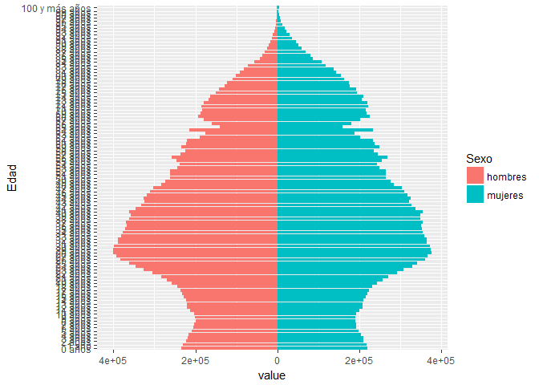
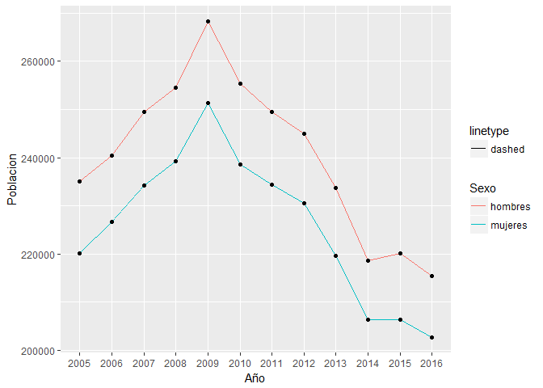
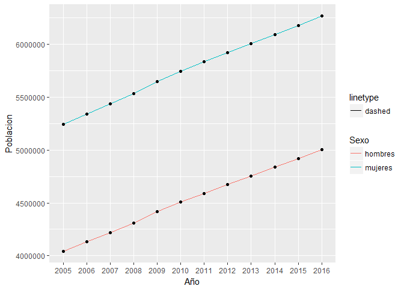

CENSO POBLACIÓN ESPAÑOLA DESDE 2005 A 2016
------------------------------------------

### Desglose de la Población por Provincia y Sexo

Hemos tomado los datos del INE desglosados por provincia y sexo para el
periodo comprendido entre 2005 y 2016, los datos están tomados a enero
de cada año. Las edades están comprendidas entre 0 y 100 años.

install.packages("knitr") install.packages("reshape")
install.packages("readxl") install.packages("devtools")
install.packages("dplyr") install.packages("stringr")
install.packages("reshape2")

    library(reshape2)
    library(reshape)

    ## 
    ## Attaching package: 'reshape'

    ## The following objects are masked from 'package:reshape2':
    ## 
    ##     colsplit, melt, recast

    library("devtools")
    library(readxl)
    library(stringr)
    library(dplyr)

    ## 
    ## Attaching package: 'dplyr'

    ## The following object is masked from 'package:reshape':
    ## 
    ##     rename

    ## The following objects are masked from 'package:stats':
    ## 
    ##     filter, lag

    ## The following objects are masked from 'package:base':
    ## 
    ##     intersect, setdiff, setequal, union

    library(plyr)

    ## -------------------------------------------------------------------------

    ## You have loaded plyr after dplyr - this is likely to cause problems.
    ## If you need functions from both plyr and dplyr, please load plyr first, then dplyr:
    ## library(plyr); library(dplyr)

    ## -------------------------------------------------------------------------

    ## 
    ## Attaching package: 'plyr'

    ## The following objects are masked from 'package:dplyr':
    ## 
    ##     arrange, count, desc, failwith, id, mutate, rename, summarise,
    ##     summarize

    ## The following objects are masked from 'package:reshape':
    ## 
    ##     rename, round_any

Año 2005 Hombres, como abrimos un fichero de forma individual:

    hombres2005 <- read_excel("2005hombres.xls")
    hombres2005 <- as.data.frame(hombres2005)
    head(hombres2005)

    ##                            Total     0 años      1 año     2 años
    ## 1      Total Nacional 21335282.9 235080.879 230516.761 221645.156
    ## 2         02 Albacete   189664.5   1951.559   1998.442   1909.135
    ## 3 03 Alicante/Alacant   828503.7   9212.118   9036.654   8591.265
    ## 4          04 Almería   309588.7   3882.548   3640.780   3406.058
    ## 5      01 Araba/Álava   149174.4   1460.493   1423.204   1317.340
    ## 6         33 Asturias   509138.8   3746.529   3642.389   3459.244
    ##       3 años     4 años     5 años     6 años     7 años     8 años
    ## 1 219513.068 216113.523 209037.106 204061.014 202123.057 199636.113
    ## 2   1903.340   1925.474   1980.933   2003.146   1959.795   2052.634
    ## 3   8859.223   8589.932   8135.678   8218.196   8064.435   8102.738
    ## 4   3637.063   3466.883   3559.829   3402.773   3381.746   3341.235
    ## 5   1301.677   1343.102   1223.144   1180.589   1189.805   1207.395
    ## 6   3786.641   3568.219   3520.709   3365.973   3444.244   3372.001
    ##       9 años    10 años    11 años    12 años    13 años    14 años
    ## 1 201172.107 203923.481 212338.017 219876.690 219769.257 222829.823
    ## 2   2109.773   2072.052   2053.355   2215.944   2269.656   2442.916
    ## 3   8059.359   8163.211   8410.586   8807.358   8934.781   9052.619
    ## 4   3457.403   3429.395   3523.532   3771.563   3699.941   4002.384
    ## 5   1142.603   1116.122   1184.894   1203.293   1268.026   1234.373
    ## 6   3452.772   3478.193   3711.825   3863.802   4056.250   4040.722
    ##      15 años    16 años    17 años    18 años    19 años    20 años
    ## 1 228153.033 231848.551 236560.261 244217.047 257001.684 270362.725
    ## 2   2370.940   2287.530   2365.428   2385.346   2424.259   2611.645
    ## 3   9015.933   9303.410   9323.642   9527.834   9884.581  10321.318
    ## 4   3970.893   3878.955   4097.721   4068.614   4232.475   4544.794
    ## 5   1330.761   1386.816   1433.164   1539.859   1616.339   1806.422
    ## 6   4200.091   4516.807   4927.901   5409.541   5663.087   5833.833
    ##      21 años    22 años    23 años    24 años    25 años    26 años
    ## 1 283492.316 305661.433 325303.835 346062.892 361328.959 383849.771
    ## 2   2697.639   2897.734   2932.622   2957.978   3192.527   3405.235
    ## 3  10653.610  11841.660  12530.102  13384.786  14063.069  14898.793
    ## 4   4941.450   5398.399   5598.999   6012.073   6307.597   6611.645
    ## 5   1868.160   1959.042   2187.770   2329.148   2430.700   2678.254
    ## 6   6296.908   6493.959   6970.929   7541.762   7875.781   8394.259
    ##      27 años    28 años    29 años    30 años    31 años    32 años
    ## 1 392113.717 401444.450 401452.421 398220.155 389606.578 388039.904
    ## 2   3242.985   3292.935   3249.929   3270.152   3239.632   3156.886
    ## 3  15186.120  15485.142  15248.806  15263.633  14912.269  14640.491
    ## 4   6598.368   6776.368   6490.501   6280.413   6070.613   6080.896
    ## 5   2758.268   2897.495   2847.989   2835.005   2782.694   2722.561
    ## 6   8622.388   8922.888   8707.181   8499.179   8114.435   8261.629
    ##      33 años    34 años    35 años    36 años    37 años    38 años
    ## 1 380672.379 376886.048 370988.799 368049.555 368515.715 361095.314
    ## 2   3105.223   3155.251   3249.694   3192.591   3195.693   3116.872
    ## 3  14432.432  14390.998  14234.989  13957.337  13901.365  13715.374
    ## 4   5754.567   5762.546   5644.018   5590.051   5502.584   5400.794
    ## 5   2790.987   2586.169   2637.387   2661.627   2601.709   2560.748
    ## 6   8215.859   7845.130   7785.248   7681.208   8005.234   7751.921
    ##      39 años    40 años    41 años    42 años    43 años    44 años
    ## 1 357417.632 362238.087 345410.265 333094.061 324505.235 327099.553
    ## 2   3128.484   3283.416   3110.469   2977.000   2974.189   3034.326
    ## 3  13432.662  13925.164  13236.070  12602.615  12271.568  12197.300
    ## 4   5171.853   5187.853   5012.637   4635.826   4500.899   4564.283
    ## 5   2562.579   2619.660   2469.695   2370.875   2353.657   2308.485
    ## 6   7876.186   8161.598   7980.899   8077.016   8132.149   8307.757
    ##      45 años    46 años    47 años    48 años    49 años    50 años
    ## 1 317806.709 310978.355 303203.787 282835.826 274237.593 260708.490
    ## 2   2881.038   2660.347   2596.237   2178.631   2091.758   2076.495
    ## 3  11855.569  11818.266  11267.056  10182.968  10260.080   9593.807
    ## 4   4433.260   4359.960   4015.633   3719.253   3671.883   3390.516
    ## 5   2361.218   2269.345   2254.325   2194.117   2068.090   2060.187
    ## 6   8282.681   8124.122   8408.441   8033.939   7702.344   7562.542
    ##      51 años    52 años    53 años    54 años    55 años    56 años
    ## 1 262313.127 261603.444 243579.208 238366.703 246000.983 257980.169
    ## 2   2050.969   2044.232   1843.027   1866.521   1938.299   1996.843
    ## 3   9717.397   9791.025   9296.983   8993.632   9117.928   9951.721
    ## 4   3399.632   3283.043   3138.694   2847.187   2933.542   3191.789
    ## 5   2051.085   2146.867   1917.598   1937.075   2035.671   2094.756
    ## 6   7570.071   7544.668   7108.630   7174.061   7211.042   7377.059
    ##      57 años    58 años    59 años    60 años    61 años    62 años
    ## 1 235334.559 223843.309 234978.080 222453.706 220222.836 189847.644
    ## 2   1769.404   1593.527   1688.278   1668.177   1737.016   1556.849
    ## 3   9350.263   8984.399   9189.195   9177.109   9075.367   8014.408
    ## 4   2773.098   2681.020   2739.454   2392.121   2400.362   2118.500
    ## 5   1954.153   1946.603   1923.913   1892.503   1777.406   1498.749
    ## 6   6667.726   6763.342   6692.049   6135.019   5896.846   4979.209
    ##      63 años    64 años    65 años    66 años    67 años    68 años
    ## 1 175408.550 214686.063 140898.978 160454.459 179089.654 193289.190
    ## 2   1416.550   2162.107   1055.079   1507.489   1727.809   1739.311
    ## 3   7841.202   9987.836   6854.258   8217.698   8085.129   7866.080
    ## 4   1922.503   2540.210   1508.989   1871.729   2157.660   2295.221
    ## 5   1383.820   1565.333   1103.591   1250.983   1224.714   1456.057
    ## 6   4721.279   4991.829   3917.147   4412.867   4682.238   5784.801
    ##      69 años    70 años    71 años    72 años    73 años    74 años
    ## 1 187332.973 183503.330 185756.519 179896.508 167943.687 162919.576
    ## 2   1784.543   1638.444   1695.219   1698.017   1669.336   1698.882
    ## 3   7843.580   7419.298   7351.724   6780.649   6368.718   6514.126
    ## 4   2205.847   2130.242   2137.639   1999.320   1870.012   1810.367
    ## 5   1381.103   1326.478   1339.064   1237.054   1235.232   1133.762
    ## 6   5606.465   5840.043   5788.052   5818.187   5268.640   5367.909
    ##       75 años     76 años     77 años     78 años     79 años     80 años
    ## 1 149459.0503 142242.8286 128043.9979 122215.8987 109236.5566 100631.1029
    ## 2   1516.3483   1488.0417   1390.6857   1299.2156   1098.6596   1063.9221
    ## 3   5619.8167   5261.3310   4624.7267   4678.4924   4083.1980   3698.5925
    ## 4   1614.2475   1516.7639   1445.7229   1335.4012   1202.0310   1104.3522
    ## 5    955.4659    983.5349    829.2129    803.7362    732.9709    628.0675
    ## 6   4718.6103   4678.2770   4246.4665   4026.8392   3693.4294   3398.2215
    ##      81 años    82 años    83 años    84 años    85 años    86 años
    ## 1 91416.5295 81544.6461 70916.8360 56676.3531 43444.5091 36873.8961
    ## 2   970.0526   838.7917   767.4397   569.9977   421.3692   356.5828
    ## 3  3217.3483  2907.6750  2508.0206  1953.6262  1466.8668  1141.2416
    ## 4   905.7169   881.7621   668.9268   551.3011   442.9648   359.4082
    ## 5   567.3461   546.9729   432.0450   379.9247   285.2422   254.2028
    ## 6  2913.7180  2735.0759  2336.5307  1954.1058  1495.3678  1230.1780
    ##      87 años    88 años    89 años    90 años     91 años     92 años
    ## 1 30855.7181 25832.7810 21786.4119 17626.0251 14065.70893 11006.17411
    ## 2   345.3424   269.2881   208.1848   200.7186   140.90000   109.80046
    ## 3   986.8872   892.1192   646.9643   555.8357   417.88132   329.20722
    ## 4   299.7771   206.9875   222.5432   156.5763   109.29430   114.16700
    ## 5   231.0684   178.6892   137.9161   126.5670    87.94939    93.01519
    ## 6  1012.8271   844.3067   706.9210   570.7868   444.68624   355.85171
    ##      93 años    94 años    95 años    96 años     97 años     98 años
    ## 1 8036.14199 5838.58144 4117.41756 2730.14249 1862.172148 1134.259484
    ## 2   71.70232   44.06605   38.58270   24.75131   24.733574    7.000000
    ## 3  213.93929  177.59952   97.70187   83.48388   62.795018   30.453224
    ## 4   64.29784   63.15023   26.53319   24.49758    8.687944    9.315742
    ## 5   57.33458   42.57806   32.78255   17.68335    3.550324    7.050000
    ## 6  266.51860  173.17865  131.42152   63.15330   65.316578   26.040478
    ##      99 años 100 y más años
    ## 1 740.062459    1146.617102
    ## 2   5.533346       9.633384
    ## 3  25.149924      34.074418
    ## 4   9.598492      14.149046
    ## 5   2.950000       5.633840
    ## 6  12.533346      22.885432

    nombres <- hombres2005$Provincia
    H2005 <- as.data.frame(t(hombres2005))
    names(H2005) <- NULL
    names(H2005) <- nombres
    H2005 <- H2005[-1,]
    H2005 <- H2005[-1,]

    #creamos columna edad
    edad <- seq(0,100,1)
    H2005$Edad <- edad
    H2005$sexo <- "H"
    H2005$año <- 2005

Todos los ficheros Excel del directorio:

    f = list.files(pattern="\\.xls")
    f

    ##  [1] "2005hombres.xls" "2005mujeres.xls" "2006hombres.xls"
    ##  [4] "2006mujeres.xls" "2007hombres.xls" "2007mujeres.xls"
    ##  [7] "2008hombres.xls" "2008mujeres.xls" "2009hombres.xls"
    ## [10] "2009mujeres.xls" "2010hombres.xls" "2010mujeres.xls"
    ## [13] "2011hombres.xls" "2011mujeres.xls" "2012hombres.xls"
    ## [16] "2012mujeres.xls" "2013hombres.xls" "2013mujeres.xls"
    ## [19] "2014hombres.xls" "2014mujeres.xls" "2015hombres.xls"
    ## [22] "2015mujeres.xls" "2016hombres.xls" "2016mujeres.xls"

Abrimos todos los ficheros xls del directorio y nos devuelve el
resultado como una lista:

    library(dplyr)
    library(plyr)
    dat = lapply(f, function(i){
        x = read_excel(i)
        # You may want to add a column to say which file they're from
        x$file = i
        # Return your data
        x
    })
    summary(dat)

    ##       Length Class  Mode
    ##  [1,] 104    tbl_df list
    ##  [2,] 104    tbl_df list
    ##  [3,] 104    tbl_df list
    ##  [4,] 104    tbl_df list
    ##  [5,] 104    tbl_df list
    ##  [6,] 104    tbl_df list
    ##  [7,] 104    tbl_df list
    ##  [8,] 104    tbl_df list
    ##  [9,] 104    tbl_df list
    ## [10,] 104    tbl_df list
    ## [11,] 104    tbl_df list
    ## [12,] 104    tbl_df list
    ## [13,] 104    tbl_df list
    ## [14,] 104    tbl_df list
    ## [15,] 104    tbl_df list
    ## [16,] 104    tbl_df list
    ## [17,] 104    tbl_df list
    ## [18,] 104    tbl_df list
    ## [19,] 104    tbl_df list
    ## [20,] 104    tbl_df list
    ## [21,] 104    tbl_df list
    ## [22,] 104    tbl_df list
    ## [23,] 104    tbl_df list
    ## [24,] 104    tbl_df list

    class(dat)

    ## [1] "list"

    names(dat[[1]])

    ##   [1] " "              "Total"          "0 años"         "1 año"         
    ##   [5] "2 años"         "3 años"         "4 años"         "5 años"        
    ##   [9] "6 años"         "7 años"         "8 años"         "9 años"        
    ##  [13] "10 años"        "11 años"        "12 años"        "13 años"       
    ##  [17] "14 años"        "15 años"        "16 años"        "17 años"       
    ##  [21] "18 años"        "19 años"        "20 años"        "21 años"       
    ##  [25] "22 años"        "23 años"        "24 años"        "25 años"       
    ##  [29] "26 años"        "27 años"        "28 años"        "29 años"       
    ##  [33] "30 años"        "31 años"        "32 años"        "33 años"       
    ##  [37] "34 años"        "35 años"        "36 años"        "37 años"       
    ##  [41] "38 años"        "39 años"        "40 años"        "41 años"       
    ##  [45] "42 años"        "43 años"        "44 años"        "45 años"       
    ##  [49] "46 años"        "47 años"        "48 años"        "49 años"       
    ##  [53] "50 años"        "51 años"        "52 años"        "53 años"       
    ##  [57] "54 años"        "55 años"        "56 años"        "57 años"       
    ##  [61] "58 años"        "59 años"        "60 años"        "61 años"       
    ##  [65] "62 años"        "63 años"        "64 años"        "65 años"       
    ##  [69] "66 años"        "67 años"        "68 años"        "69 años"       
    ##  [73] "70 años"        "71 años"        "72 años"        "73 años"       
    ##  [77] "74 años"        "75 años"        "76 años"        "77 años"       
    ##  [81] "78 años"        "79 años"        "80 años"        "81 años"       
    ##  [85] "82 años"        "83 años"        "84 años"        "85 años"       
    ##  [89] "86 años"        "87 años"        "88 años"        "89 años"       
    ##  [93] "90 años"        "91 años"        "92 años"        "93 años"       
    ##  [97] "94 años"        "95 años"        "96 años"        "97 años"       
    ## [101] "98 años"        "99 años"        "100 y más años" "file"

    names(dat[[2]])

    ##   [1] " "              "Total"          "0 años"         "1 año"         
    ##   [5] "2 años"         "3 años"         "4 años"         "5 años"        
    ##   [9] "6 años"         "7 años"         "8 años"         "9 años"        
    ##  [13] "10 años"        "11 años"        "12 años"        "13 años"       
    ##  [17] "14 años"        "15 años"        "16 años"        "17 años"       
    ##  [21] "18 años"        "19 años"        "20 años"        "21 años"       
    ##  [25] "22 años"        "23 años"        "24 años"        "25 años"       
    ##  [29] "26 años"        "27 años"        "28 años"        "29 años"       
    ##  [33] "30 años"        "31 años"        "32 años"        "33 años"       
    ##  [37] "34 años"        "35 años"        "36 años"        "37 años"       
    ##  [41] "38 años"        "39 años"        "40 años"        "41 años"       
    ##  [45] "42 años"        "43 años"        "44 años"        "45 años"       
    ##  [49] "46 años"        "47 años"        "48 años"        "49 años"       
    ##  [53] "50 años"        "51 años"        "52 años"        "53 años"       
    ##  [57] "54 años"        "55 años"        "56 años"        "57 años"       
    ##  [61] "58 años"        "59 años"        "60 años"        "61 años"       
    ##  [65] "62 años"        "63 años"        "64 años"        "65 años"       
    ##  [69] "66 años"        "67 años"        "68 años"        "69 años"       
    ##  [73] "70 años"        "71 años"        "72 años"        "73 años"       
    ##  [77] "74 años"        "75 años"        "76 años"        "77 años"       
    ##  [81] "78 años"        "79 años"        "80 años"        "81 años"       
    ##  [85] "82 años"        "83 años"        "84 años"        "85 años"       
    ##  [89] "86 años"        "87 años"        "88 años"        "89 años"       
    ##  [93] "90 años"        "91 años"        "92 años"        "93 años"       
    ##  [97] "94 años"        "95 años"        "96 años"        "97 años"       
    ## [101] "98 años"        "99 años"        "100 y más años" "file"

    identical(names(dat[[1]]),names(dat[[22]]))

    ## [1] TRUE

Comprobamos que las columnas tienen los mismos nombres en todos los
ficheros

    d <- do.call("rbind",dat)
    head(d)

    ## # A tibble: 6 × 104
    ##                   ` `      Total   `0 años`    `1 año`   `2 años`
    ##                 <chr>      <dbl>      <dbl>      <dbl>      <dbl>
    ## 1      Total Nacional 21335282.9 235080.879 230516.761 221645.156
    ## 2         02 Albacete   189664.5   1951.559   1998.442   1909.135
    ## 3 03 Alicante/Alacant   828503.7   9212.118   9036.654   8591.265
    ## 4          04 Almería   309588.7   3882.548   3640.780   3406.058
    ## 5      01 Araba/Álava   149174.4   1460.493   1423.204   1317.340
    ## 6         33 Asturias   509138.8   3746.529   3642.389   3459.244
    ## # ... with 99 more variables: `3 años` <dbl>, `4 años` <dbl>, `5
    ## #   años` <dbl>, `6 años` <dbl>, `7 años` <dbl>, `8 años` <dbl>, `9
    ## #   años` <dbl>, `10 años` <dbl>, `11 años` <dbl>, `12 años` <dbl>, `13
    ## #   años` <dbl>, `14 años` <dbl>, `15 años` <dbl>, `16 años` <dbl>, `17
    ## #   años` <dbl>, `18 años` <dbl>, `19 años` <dbl>, `20 años` <dbl>, `21
    ## #   años` <dbl>, `22 años` <dbl>, `23 años` <dbl>, `24 años` <dbl>, `25
    ## #   años` <dbl>, `26 años` <dbl>, `27 años` <dbl>, `28 años` <dbl>, `29
    ## #   años` <dbl>, `30 años` <dbl>, `31 años` <dbl>, `32 años` <dbl>, `33
    ## #   años` <dbl>, `34 años` <dbl>, `35 años` <dbl>, `36 años` <dbl>, `37
    ## #   años` <dbl>, `38 años` <dbl>, `39 años` <dbl>, `40 años` <dbl>, `41
    ## #   años` <dbl>, `42 años` <dbl>, `43 años` <dbl>, `44 años` <dbl>, `45
    ## #   años` <dbl>, `46 años` <dbl>, `47 años` <dbl>, `48 años` <dbl>, `49
    ## #   años` <dbl>, `50 años` <dbl>, `51 años` <dbl>, `52 años` <dbl>, `53
    ## #   años` <dbl>, `54 años` <dbl>, `55 años` <dbl>, `56 años` <dbl>, `57
    ## #   años` <dbl>, `58 años` <dbl>, `59 años` <dbl>, `60 años` <dbl>, `61
    ## #   años` <dbl>, `62 años` <dbl>, `63 años` <dbl>, `64 años` <dbl>, `65
    ## #   años` <dbl>, `66 años` <dbl>, `67 años` <dbl>, `68 años` <dbl>, `69
    ## #   años` <dbl>, `70 años` <dbl>, `71 años` <dbl>, `72 años` <dbl>, `73
    ## #   años` <dbl>, `74 años` <dbl>, `75 años` <dbl>, `76 años` <dbl>, `77
    ## #   años` <dbl>, `78 años` <dbl>, `79 años` <dbl>, `80 años` <dbl>, `81
    ## #   años` <dbl>, `82 años` <dbl>, `83 años` <dbl>, `84 años` <dbl>, `85
    ## #   años` <dbl>, `86 años` <dbl>, `87 años` <dbl>, `88 años` <dbl>, `89
    ## #   años` <dbl>, `90 años` <dbl>, `91 años` <dbl>, `92 años` <dbl>, `93
    ## #   años` <dbl>, `94 años` <dbl>, `95 años` <dbl>, `96 años` <dbl>, `97
    ## #   años` <dbl>, `98 años` <dbl>, `99 años` <dbl>, `100 y más años` <dbl>,
    ## #   file <chr>

    dim(d)

    ## [1] 1278  104

Hay NA en el fichero creado

    missing <- d[!complete.cases(d),]
    d <- d[complete.cases(d),]
    d <- as.data.frame(d)

Ahora si tenemos el número de filas correcto 24 ficheros \* 53 filas
cada fichero

Comprobamos un fichero al azar: "2008mujeres.xls"

    M2008 <- d[d$file=="2008mujeres.xls",]
    head(M2008)

    ##                              Total     0 años      1 año     2 años
    ## 372      Total Nacional 23077454.2 239328.468 237406.795 233568.129
    ## 373         02 Albacete   196261.4   1810.248   1949.523   1850.989
    ## 374 03 Alicante/Alacant   907898.8   9261.288   9280.877   9257.818
    ## 375          04 Almería   320854.6   4099.970   4206.301   3863.093
    ## 376      01 Araba/Álava   155470.3   1527.492   1439.562   1440.880
    ## 377         33 Asturias   557298.4   3797.627   3731.795   3747.882
    ##         3 años     4 años     5 años     6 años     7 años     8 años
    ## 372 230351.957 227841.838 218058.649 217735.636 213930.207 209329.879
    ## 373   1796.242   1961.805   1928.798   1963.411   2004.960   1937.578
    ## 374   9120.092   9120.881   8750.782   8742.918   8551.244   8624.705
    ## 375   3857.848   3683.550   3619.832   3630.965   3470.709   3490.462
    ## 376   1457.736   1428.689   1319.984   1310.914   1343.658   1307.435
    ## 377   3614.948   3671.915   3535.702   3517.804   3473.242   3359.031
    ##         9 años    10 años    11 años    12 años    13 años    14 años
    ## 372 202170.885 202915.408 200920.135 200660.588 202576.981 210498.159
    ## 373   1964.902   1958.446   1947.156   2008.527   2079.171   2033.425
    ## 374   8237.784   8220.676   8426.247   8271.772   8453.681   8447.939
    ## 375   3365.398   3422.035   3415.286   3441.006   3366.406   3554.323
    ## 376   1227.049   1215.300   1191.132   1149.027   1093.959   1223.237
    ## 377   3377.552   3323.967   3426.582   3435.363   3523.185   3576.716
    ##        15 años    16 años    17 años    18 años    19 años    20 años
    ## 372 218323.419 217202.279 221565.239 229609.883 238726.645 248114.912
    ## 373   2261.175   2271.697   2330.561   2354.199   2298.599   2485.002
    ## 374   9037.183   9084.894   9031.417   9367.352   9780.698   9976.062
    ## 375   3703.825   3705.539   3917.759   3739.696   4026.295   4192.759
    ## 376   1190.835   1224.535   1253.591   1262.287   1462.689   1433.050
    ## 377   3917.789   3968.713   4049.526   4211.600   4445.576   4918.250
    ##        21 años    22 años    23 años    24 años    25 años    26 años
    ## 372 260134.099 273941.203 289313.074 302882.243 323951.425 340892.556
    ## 373   2465.348   2480.580   2569.932   2609.897   2724.284   2832.801
    ## 374  10495.255  10859.415  11265.520  11950.666  12493.630  13426.328
    ## 375   4314.525   4418.833   4673.095   4810.381   5253.862   5420.166
    ## 376   1535.664   1836.363   1813.381   1919.667   1981.970   2217.363
    ## 377   5213.362   5530.102   5937.433   6153.353   6618.118   7121.068
    ##        27 años    28 años    29 años    30 años    31 años    32 años
    ## 372 359770.721 371815.822 387755.423 392199.210 400686.399 396777.129
    ## 373   2870.258   2973.738   3068.946   3020.118   3197.305   3132.536
    ## 374  14202.677  14433.645  14995.953  15139.150  15490.428  14919.533
    ## 375   5638.920   5670.039   5784.728   5920.487   5924.456   5831.612
    ## 376   2207.117   2461.504   2558.929   2496.313   2756.688   2688.195
    ## 377   7420.982   7811.443   8103.963   8402.089   8466.110   8500.635
    ##        33 años    34 años    35 años    36 años    37 años    38 años
    ## 372 394258.372 383943.160 382139.473 376405.685 372010.014 369342.178
    ## 373   3118.867   2967.464   3042.243   2965.588   3151.552   3211.948
    ## 374  15210.045  14716.771  14494.524  14439.909  14430.897  14291.783
    ## 375   5740.397   5541.992   5489.917   5382.491   5218.812   5217.206
    ## 376   2648.641   2585.221   2585.676   2626.754   2540.899   2561.284
    ## 377   8491.890   8211.950   8359.065   8190.667   7958.601   7925.964
    ##        39 años    40 años    41 años    42 años    43 años    44 años
    ## 372 367488.569 370567.891 361235.039 360421.712 365812.848 348547.789
    ## 373   3158.198   3065.198   3120.001   3113.559   3201.998   3063.671
    ## 374  14257.200  14278.258  13972.578  13693.533  14439.795  13327.358
    ## 375   5312.200   5265.885   5161.330   5038.976   5152.369   4789.571
    ## 376   2434.141   2510.120   2576.257   2557.720   2544.479   2492.230
    ## 377   7827.677   8157.313   8080.325   8178.307   8542.055   8402.691
    ##        45 años    46 años    47 años    48 años    49 años    50 años
    ## 372 338274.594 331152.930 333621.935 325058.739 318456.881 311100.992
    ## 373   2938.363   2821.881   2835.208   2708.952   2643.608   2488.592
    ## 374  13147.738  12720.072  12660.208  12498.913  12467.527  12045.093
    ## 375   4481.134   4456.597   4506.183   4296.912   4259.481   4114.924
    ## 376   2539.661   2425.661   2460.359   2356.125   2346.910   2320.332
    ## 377   8400.882   8369.241   8730.778   8763.168   8777.668   8750.081
    ##        51 años    52 años    53 años    54 años    55 años    56 años
    ## 372 290779.607 282373.253 270693.763 269870.216 268405.209 252154.780
    ## 373   2141.383   2116.454   2023.511   2081.029   1982.990   1818.504
    ## 374  11220.892  11247.943  10588.224  10690.077  10870.882  10446.143
    ## 375   3551.264   3558.037   3316.614   3321.653   3380.843   3168.563
    ## 376   2217.714   2161.413   2051.930   2061.718   2039.152   1971.304
    ## 377   8607.333   8213.483   7899.427   7977.646   7832.086   7287.404
    ##        57 años    58 años    59 años    60 años    61 años    62 años
    ## 372 247018.810 258519.798 270489.275 247795.039 238506.340 250054.926
    ## 373   1904.708   1859.225   2090.684   1795.547   1716.751   1801.131
    ## 374  10419.893  10883.702  11473.176  11166.773  10690.836  10675.564
    ## 375   3106.901   3118.790   3283.506   3115.716   2963.340   2847.906
    ## 376   1932.116   2024.062   2023.625   1864.881   1836.288   1904.263
    ## 377   7196.226   7628.578   7811.282   7254.350   7252.900   7267.949
    ##        63 años    64 años    65 años    66 años    67 años    68 años
    ## 372 238502.789 234966.876 203374.667 187741.585 232207.652 157602.776
    ## 373   1900.772   1743.335   1633.171   1525.934   2273.596   1164.725
    ## 374  10737.848  10157.616   9267.574   8709.768  10922.270   7303.158
    ## 375   2683.130   2672.495   2365.070   2076.768   2748.107   1756.953
    ## 376   1773.108   1702.473   1411.639   1344.585   1477.926   1166.444
    ## 377   6708.598   6479.452   5264.987   5060.984   5335.999   4443.078
    ##        69 años    70 años    71 años    72 años    73 años    74 años
    ## 372 178306.762 199614.764 221196.417 211961.306 210245.417 214535.325
    ## 373   1661.568   1800.474   1954.720   1889.064   1801.694   1927.304
    ## 374   8610.288   8590.617   8259.040   7995.533   7848.659   7970.710
    ## 375   2167.162   2423.126   2447.170   2475.497   2319.495   2245.336
    ## 376   1122.515   1233.402   1545.902   1359.844   1381.265   1386.461
    ## 377   5145.153   5501.784   6731.123   6515.347   6807.932   6811.924
    ##        75 años    76 años    77 años    78 años    79 años    80 años
    ## 372 210359.611 197124.877 197755.068 182924.493 177907.753 161744.729
    ## 373   1823.932   1840.665   1948.125   1801.541   1653.397   1504.301
    ## 374   7177.172   6924.664   7211.903   6327.553   6225.515   5534.111
    ## 375   2319.341   2144.652   2200.180   1871.288   1872.619   1695.460
    ## 376   1338.890   1334.422   1314.094   1126.827   1139.884   1023.738
    ## 377   7065.571   6466.420   6771.226   6221.658   6135.266   5613.796
    ##         81 años     82 años     83 años     84 años     85 años    86 años
    ## 372 156745.8365 143931.6436 134520.9956 121923.7377 113965.2903 95266.1148
    ## 373   1469.4545   1294.3604   1238.7893   1085.8689   1038.2954   884.9552
    ## 374   5404.0265   5073.1126   4588.6286   3924.9987   3824.3255  3196.6333
    ## 375   1591.9592   1488.7700   1264.9282   1114.3655   1101.0098   859.1888
    ## 376    988.3943    967.3426    874.0478    806.4285    770.2982   655.6914
    ## 377   5433.7667   5108.6213   4756.1032   4304.6210   4089.5963  3292.7520
    ##        87 años    88 años    89 años    90 años    91 años    92 años
    ## 372 83916.2235 64822.2682 57345.7893 47023.5297 38624.3512 31916.5071
    ## 373   714.1569   528.4636   484.8277   364.9120   327.6491   267.9764
    ## 374  2608.7218  2028.4419  1705.4448  1338.2359  1080.1558   920.0104
    ## 375   703.4507   559.8413   449.0157   407.1181   295.6328   267.3511
    ## 376   605.4633   441.8497   418.9392   355.4172   290.4285   243.6398
    ## 377  3049.4663  2413.3140  2099.7507  1599.5694  1450.0267  1111.5449
    ##        93 años    94 años     95 años     96 años    97 años    98 años
    ## 372 26060.0603 19966.7672 15246.30411 10407.68496 7406.65804 4875.83488
    ## 373   156.7618   142.2211   133.83261    75.55824   45.62972   27.00886
    ## 374   628.2581   491.9889   360.48225   233.57141  192.32355  123.59345
    ## 375   200.3453   137.4568    99.19514    69.30540   60.57525   40.70322
    ## 376   208.9358   150.0215   124.37611    71.77500   48.32533   33.74937
    ## 377   956.3029   706.3692   593.26033   313.91736  263.74226  172.83077
    ##        99 años 100 y más años            file
    ## 372 3036.18184     4924.38004 2008mujeres.xls
    ## 373   15.18148       26.26359 2008mujeres.xls
    ## 374   70.58752      146.41306 2008mujeres.xls
    ## 375   20.60310       46.22703 2008mujeres.xls
    ## 376   16.79423       37.80774 2008mujeres.xls
    ## 377  133.55988      118.59350 2008mujeres.xls

    tail(M2008)

    ##                               Total     0 años      1 año     2 años
    ## 419 46 Valencia/València 1272270.40 14009.6968 13473.4053 13476.8659
    ## 420        47 Valladolid  267326.64  2278.0849  2347.5867  2304.8016
    ## 421            49 Zamora   98817.90   572.5230   596.0624   588.1070
    ## 422          50 Zaragoza  481290.15  4690.3666  4599.6166  4507.1811
    ## 423             51 Ceuta   37204.64   564.3786   553.4543   545.9432
    ## 424           52 Melilla   35183.73   545.4170   581.9112   535.8918
    ##         3 años     4 años     5 años     6 años     7 años     8 años
    ## 419 13053.8278 13036.6339 12037.8491 12016.2708 12132.1143 11706.2397
    ## 420  2278.5418  2344.8599  2152.3832  2169.2214  2096.6400  2126.1543
    ## 421   611.9828   650.9113   623.7136   608.1834   639.1676   610.0133
    ## 422  4572.4590  4418.6275  4205.6313  4273.6929  3993.6132  3907.1642
    ## 423   517.4148   511.4763   521.1960   473.8316   501.5882   536.7914
    ## 424   519.5970   577.2132   521.0896   531.9128   515.6412   483.3310
    ##         9 años    10 años    11 años    12 años    13 años    14 años
    ## 419 11126.7783 11056.9173 10873.5710 10903.7895 10959.9208 11390.3199
    ## 420  2028.4629  2126.2950  1989.0399  2026.1822  2066.0308  2125.2974
    ## 421   687.9873   655.3215   656.7458   694.8402   657.6386   762.1403
    ## 422  3843.9759  3898.7170  3851.0371  3879.7362  3961.4331  3981.6849
    ## 423   455.7995   501.3903   449.9722   474.7226   464.0573   529.4984
    ## 424   505.2128   491.2746   466.4115   488.1052   495.5844   506.5999
    ##        15 años    16 años    17 años    18 años    19 años    20 años
    ## 419 11905.7344 11868.8780 11989.6500 12289.1833 12762.3682 13204.0734
    ## 420  2204.2010  2116.7934  2199.5875  2413.8101  2377.2208  2649.0955
    ## 421   815.0702   803.6326   899.3132   878.6310   935.4557   981.4394
    ## 422  4162.4295  4122.0704  3997.0783  4367.2965  4793.7088  4923.1937
    ## 423   479.3757   462.2940   482.7747   487.8597   542.5086   535.7172
    ## 424   483.1355   431.2180   491.8651   475.1672   467.1707   466.3300
    ##        21 años    22 años    23 años    24 años    25 años    26 años
    ## 419 14182.7288 15130.1388 16075.3965 16462.2720 17915.7291 19119.7723
    ## 420  2709.5586  2874.6263  3162.5315  3214.5135  3430.1938  3600.0757
    ## 421   949.6250  1075.7753  1023.1956  1100.6893  1147.6053  1092.5755
    ## 422  5090.9077  5371.1163  5529.0181  5749.9975  6323.3559  6597.9832
    ## 423   516.3187   589.1709   536.6729   575.0267   578.4276   585.9990
    ## 424   511.1462   493.0112   512.2279   525.8797   528.0222   597.8623
    ##        27 años    28 años    29 años    30 años    31 años    32 años
    ## 419 20519.9909 21490.8575 22426.3289 22774.5093 22817.3517 22428.0235
    ## 420  3952.0964  4129.8512  4440.3816  4320.6859  4658.0589  4255.0630
    ## 421  1165.5796  1238.0539  1216.6711  1244.2922  1245.6965  1220.2022
    ## 422  7091.7035  7398.1193  7698.3914  7928.2602  7935.9792  7978.6997
    ## 423   589.7315   599.8579   582.3087   590.9422   602.1319   620.8974
    ## 424   612.1406   617.8174   600.9096   579.7612   521.1245   568.6224
    ##        33 años    34 años    35 años    36 años    37 años    38 años
    ## 419 22614.9807 21300.1196 21085.3688 21088.9235 20687.8556 20585.6644
    ## 420  4509.4306  4366.7767  4399.8628  4256.3349  4264.8862  4258.9028
    ## 421  1177.6809  1192.7115  1174.5276  1210.3859  1240.3496  1213.5778
    ## 422  7781.0841  7715.1477  7883.9326  7643.9829  7571.6527  7278.4104
    ## 423   597.1081   564.6368   570.5336   541.4381   595.9337   555.3541
    ## 424   551.3939   536.6870   555.3391   523.1335   552.1232   548.1581
    ##        39 años    40 años    41 años    42 años    43 años    44 años
    ## 419 20326.5578 20648.5959 19866.6944 19881.9925 20022.7555 18922.1191
    ## 420  4225.2578  4298.9934  4207.9063  4206.9231  4204.1113  4111.0690
    ## 421  1320.6767  1384.9723  1339.6922  1341.6813  1403.6645  1332.8429
    ## 422  7467.5112  7503.5190  7265.8155  7197.6202  7379.5852  7013.5949
    ## 423   522.2516   576.7717   564.2142   525.8948   650.2295   536.5002
    ## 424   500.3442   561.1658   556.4449   556.5967   536.8644   458.2554
    ##        45 años    46 años    47 años    48 años    49 años    50 años
    ## 419 18684.5466 18242.5247 18695.6179 18355.5037 17449.1194 17121.3786
    ## 420  4025.0389  3980.7099  4070.6050  4100.3211  3864.5130  3960.4092
    ## 421  1386.5667  1393.6193  1386.7199  1309.8077  1340.5909  1248.0191
    ## 422  6934.8591  6892.1009  7104.3113  6774.1514  6686.7932  6625.1711
    ## 423   563.7579   526.8624   572.7249   503.2960   514.0131   494.5404
    ## 424   499.5298   465.4600   524.3488   480.5092   478.4367   468.9411
    ##        51 años    52 años    53 años    54 años    55 años    56 años
    ## 419 16110.9388 15476.0985 15014.6032 14880.4323 15161.9542 14054.8771
    ## 420  3798.4856  3612.4141  3443.3833  3509.0267  3433.9064  3229.5127
    ## 421  1268.1612  1123.3301  1116.6773  1074.5626  1144.7408  1013.4926
    ## 422  6321.8095  6088.9480  5745.9900  5754.8067  5854.1220  5479.5007
    ## 423   447.0866   435.1567   413.9768   400.8581   363.4731   305.2715
    ## 424   428.1933   400.0977   357.7168   345.0781   328.5667   286.7224
    ##        57 años    58 años    59 años    60 años    61 años    62 años
    ## 419 13945.7994 14470.1763 14776.0066 13754.6599 13040.8948 13539.6421
    ## 420  3455.2489  3492.2459  3536.8793  3188.1053  2935.4480  3355.1581
    ## 421  1068.1806  1124.9230  1208.6889  1077.8657   977.9419  1190.6478
    ## 422  5407.5462  5667.9744  5884.8200  5410.3802  5394.0269  5453.9339
    ## 423   328.7174   316.0867   323.1116   309.6955   298.2910   289.1694
    ## 424   311.8493   265.1114   248.9923   247.2994   236.3356   260.5483
    ##        63 años    64 años    65 años    66 años    67 años   68 años
    ## 419 13038.5643 12661.3696 11442.6238 10257.5187 14414.3258 8305.0362
    ## 420  3176.9581  3082.8565  2699.2241  2479.7490  2802.4131 2049.6580
    ## 421  1117.7872  1186.8263  1099.5089  1075.4314  1288.0873  950.0473
    ## 422  5075.1570  5122.4423  4607.3409  4284.0456  4787.8052 3593.3135
    ## 423   301.3046   299.5453   276.7148   240.4666   310.5393  264.9221
    ## 424   263.5409   231.4926   254.9394   188.1482   248.2369  207.9115
    ##        69 años    70 años    71 años    72 años    73 años    74 años
    ## 419 10511.7931 11400.9177 11195.3473 11128.6033 11143.5017 11363.7392
    ## 420  1976.3744  2228.2955  2755.3978  2470.2289  2540.7091  2482.6450
    ## 421  1020.8556  1274.5054  1641.3839  1472.0314  1460.1071  1505.8213
    ## 422  3598.0541  4143.7946  5040.3822  4787.1555  4929.8970  5009.2125
    ## 423   260.1168   201.1007   297.0743   259.7025   244.7313   249.7566
    ## 424   202.1392   249.1328   288.5793   229.6887   229.8155   200.8083
    ##        75 años    76 años    77 años   78 años   79 años   80 años
    ## 419 10752.1647 10515.1311 10559.5716 9602.4715 9388.5363 8569.6888
    ## 420  2494.2700  2365.6946  2356.5116 2182.8899 2238.8539 1961.4865
    ## 421  1487.3376  1398.2994  1412.9062 1320.3078 1370.4812 1313.4318
    ## 422  5076.7622  4619.4540  4703.2908 4474.6021 4318.7712 3972.1416
    ## 423   257.4317   212.9515   237.5851  203.2343  182.5345  164.9366
    ## 424   202.6263   169.2526   235.8738  181.4331  155.3958  138.1460
    ##       81 años   82 años   83 años    84 años    85 años    86 años
    ## 419 8473.2576 7619.0690 6961.2421 6274.45992 5910.91606 4758.28587
    ## 420 2034.4139 1817.8502 1763.7619 1563.71935 1500.95323 1230.03610
    ## 421 1264.4838 1111.7892 1079.0376 1026.78895  946.32381  794.17914
    ## 422 3899.4578 3559.2177 3452.5139 3229.70485 3007.86897 2577.58293
    ## 423  155.7537  130.8597  121.6501  102.24981   87.95860   81.17419
    ## 424  177.0320  132.1201  119.6879   87.86818   85.17374   64.22389
    ##        87 años    88 años    89 años    90 años    91 años    92 años
    ## 419 4212.36986 3174.76658 2816.02822 2309.77086 1740.32620 1451.39348
    ## 420 1108.58812  820.59758  718.81852  636.72355  517.33689  493.06863
    ## 421  662.52561  535.93570  478.05673  430.46881  356.29052  311.51015
    ## 422 2280.60022 1687.21733 1521.05664 1196.87317  946.44746  770.07941
    ## 423   60.88285   52.74192   43.16149   25.47795   24.31749   25.27014
    ## 424   70.94464   46.42605   38.29939   42.55715   23.69920   22.08550
    ##        93 años   94 años    95 años    96 años    97 años    98 años
    ## 419 1153.95922 831.67318 662.957553 417.382041 345.101176 170.207325
    ## 420  350.91864 307.72104 227.247302 137.939959  95.231213  92.043778
    ## 421  283.59016 200.15922 163.520028 114.540860  86.162001  63.465943
    ## 422  620.39385 475.30749 384.432681 260.712817 182.250194  98.604259
    ## 423   23.62456  12.49895   8.318079   1.016358   6.766716   4.616642
    ## 424   18.76191  15.39104  11.300074  13.233172   7.000678   2.533358
    ##        99 años 100 y más años            file
    ## 419 113.381328     199.357761 2008mujeres.xls
    ## 420  29.028223      66.636685 2008mujeres.xls
    ## 421  22.095521      55.673564 2008mujeres.xls
    ## 422  83.121528      85.733622 2008mujeres.xls
    ## 423   0.079308       5.090157 2008mujeres.xls
    ## 424   3.234008       6.150000 2008mujeres.xls

Coincide con nuestro fichero Excel ha importado los datos correctamente.

Incluimos el nombre de la primera columna que será Provincia:

    colnames(d)[1] <- "Provincia"
    names(d)

    ##   [1] "Provincia"      "Total"          "0 años"         "1 año"         
    ##   [5] "2 años"         "3 años"         "4 años"         "5 años"        
    ##   [9] "6 años"         "7 años"         "8 años"         "9 años"        
    ##  [13] "10 años"        "11 años"        "12 años"        "13 años"       
    ##  [17] "14 años"        "15 años"        "16 años"        "17 años"       
    ##  [21] "18 años"        "19 años"        "20 años"        "21 años"       
    ##  [25] "22 años"        "23 años"        "24 años"        "25 años"       
    ##  [29] "26 años"        "27 años"        "28 años"        "29 años"       
    ##  [33] "30 años"        "31 años"        "32 años"        "33 años"       
    ##  [37] "34 años"        "35 años"        "36 años"        "37 años"       
    ##  [41] "38 años"        "39 años"        "40 años"        "41 años"       
    ##  [45] "42 años"        "43 años"        "44 años"        "45 años"       
    ##  [49] "46 años"        "47 años"        "48 años"        "49 años"       
    ##  [53] "50 años"        "51 años"        "52 años"        "53 años"       
    ##  [57] "54 años"        "55 años"        "56 años"        "57 años"       
    ##  [61] "58 años"        "59 años"        "60 años"        "61 años"       
    ##  [65] "62 años"        "63 años"        "64 años"        "65 años"       
    ##  [69] "66 años"        "67 años"        "68 años"        "69 años"       
    ##  [73] "70 años"        "71 años"        "72 años"        "73 años"       
    ##  [77] "74 años"        "75 años"        "76 años"        "77 años"       
    ##  [81] "78 años"        "79 años"        "80 años"        "81 años"       
    ##  [85] "82 años"        "83 años"        "84 años"        "85 años"       
    ##  [89] "86 años"        "87 años"        "88 años"        "89 años"       
    ##  [93] "90 años"        "91 años"        "92 años"        "93 años"       
    ##  [97] "94 años"        "95 años"        "96 años"        "97 años"       
    ## [101] "98 años"        "99 años"        "100 y más años" "file"

De la columna "file" (character) vamos a extraer dos columnas "Año" y
"Sexo":

    str(d$file)

    ##  chr [1:1272] "2005hombres.xls" "2005hombres.xls" ...

    d$charfile <- nchar(d$file) #numero de caracteres que tiene el string de la columna "file"
    d$charfile <- NULL

Comprobamos con un ejemplo si nuestra fórmula es correcta:

    x <- "2005hombres.xls"
    y <- substr(x,1,10)
    año <- substr(substr(x,1,10),-4,4)
    año

    ## [1] "2005"

    sexo <- substr(substr(x,1,10),5,10)
    sexo

    ## [1] "hombre"

Extraemos el año y el sexo para toda la columna:

    d$año <- substr(substr(d$file,1,10),-4,4)
    d$sexo <- substr(substr(d$file,1,11),5,11)
    d$año <- as.factor(d$año)
    d$sexo <- as.factor(d$sexo)
    summary(d$sexo)

    ## hombres mujeres 
    ##     636     636

    d$Provincia <- as.factor(d$Provincia)
    d$file <- as.factor(d$file)

Grabamos el fichero con los totales en un csv:

    write.csv(d,"Censo2005_2016.csv",row.names = FALSE)

Aplicamos melt al fichero d (no lo abrimos porque da problemas con los
titulos)

    CensoTotal <- melt(d)

    ## Using Provincia, file, año, sexo as id variables

    CensoTotal$file <- NULL
    head(CensoTotal)

    ##             Provincia  año    sexo variable      value
    ## 1      Total Nacional 2005 hombres    Total 21335282.9
    ## 2         02 Albacete 2005 hombres    Total   189664.5
    ## 3 03 Alicante/Alacant 2005 hombres    Total   828503.7
    ## 4          04 Almería 2005 hombres    Total   309588.7
    ## 5      01 Araba/Álava 2005 hombres    Total   149174.4
    ## 6         33 Asturias 2005 hombres    Total   509138.8

    dim(CensoTotal) #102 edades x 24 ficheros x 53 provincias contando el Total

    ## [1] 129744      5

Cambiamos nombres columnas

    colnames(CensoTotal) <- c("Provincia","Año","Sexo","Edad","Poblacion")
    write.csv(CensoTotal,"CensoTotal.csv",row.names = FALSE,col.names = TRUE)

    ## Warning in write.csv(CensoTotal, "CensoTotal.csv", row.names = FALSE,
    ## col.names = TRUE): attempt to set 'col.names' ignored

Vamos a dejar la tabla sin Totales, ya que éstos se pueden calcular a
partir del resto de datos,

Análisis a nivel Nacional
-------------------------

Población a nivel nacional por sexos para cada año:

    TotalNac <- CensoTotal[CensoTotal$Provincia=="Total Nacional",]
    melttotal <- melt(TotalNac)

    ## Using Provincia, Año, Sexo, Edad as id variables

    cols <- c("Año","Sexo","Edad","value")
    melttotal <- melttotal[,cols]

Total Nacional para un año:

    TotalNac2005 <- filter(melttotal,Año=="2005")
    TN2005 <- melt(TotalNac2005)

    ## Using Año, Sexo, Edad as id variables

    cols <- c("Sexo","Edad","value")
    TN2005 <- TN2005[,cols]

Grádico de una tabla de frecuencias para el año 2005

    library(ggplot2)
    totales2005 <- TN2005[TN2005$Edad!="Total",]#quitamos el total nacional que suma todas las edades

    library(ggplot2)
    g1 <- ggplot(data = totales2005, aes(x = Edad, y = value, fill = Sexo)) +
      geom_bar(data = subset(totales2005, Sexo=="mujeres"),
               stat = "identity") +
      geom_bar(data = subset(totales2005, Sexo=="hombres"),
               stat = "identity",
               position = "identity",
               mapping = aes(y = -value)) +
      scale_y_continuous(labels = abs) +
      coord_flip()
    g1

Análisis a nivel Provincia
--------------------------

    head(CensoTotal)

    ##             Provincia  Año    Sexo  Edad  Poblacion
    ## 1      Total Nacional 2005 hombres Total 21335282.9
    ## 2         02 Albacete 2005 hombres Total   189664.5
    ## 3 03 Alicante/Alacant 2005 hombres Total   828503.7
    ## 4          04 Almería 2005 hombres Total   309588.7
    ## 5      01 Araba/Álava 2005 hombres Total   149174.4
    ## 6         33 Asturias 2005 hombres Total   509138.8

    Albacete <- CensoTotal[CensoTotal$Provincia=="02 Albacete",]

Nivel Nacional
--------------

    head(CensoTotal)

    ##             Provincia  Año    Sexo  Edad  Poblacion
    ## 1      Total Nacional 2005 hombres Total 21335282.9
    ## 2         02 Albacete 2005 hombres Total   189664.5
    ## 3 03 Alicante/Alacant 2005 hombres Total   828503.7
    ## 4          04 Almería 2005 hombres Total   309588.7
    ## 5      01 Araba/Álava 2005 hombres Total   149174.4
    ## 6         33 Asturias 2005 hombres Total   509138.8

    Nacional <- CensoTotal[CensoTotal$Provincia=="Total Nacional",]
    Nacional <- Nacional[Nacional$Edad!="Total",]
    head(Nacional)

    ##           Provincia  Año    Sexo   Edad Poblacion
    ## 1273 Total Nacional 2005 hombres 0 años  235080.9
    ## 1326 Total Nacional 2005 mujeres 0 años  220123.0
    ## 1379 Total Nacional 2006 hombres 0 años  240394.8
    ## 1432 Total Nacional 2006 mujeres 0 años  226588.9
    ## 1485 Total Nacional 2007 hombres 0 años  249534.5
    ## 1538 Total Nacional 2007 mujeres 0 años  234148.7

Evolución Nacimientos en España desde 2005 a 2016:

    Nacional0 <- Nacional[Nacional$Edad=="0 años",]
    Nacional0

    ##           Provincia  Año    Sexo   Edad Poblacion
    ## 1273 Total Nacional 2005 hombres 0 años  235080.9
    ## 1326 Total Nacional 2005 mujeres 0 años  220123.0
    ## 1379 Total Nacional 2006 hombres 0 años  240394.8
    ## 1432 Total Nacional 2006 mujeres 0 años  226588.9
    ## 1485 Total Nacional 2007 hombres 0 años  249534.5
    ## 1538 Total Nacional 2007 mujeres 0 años  234148.7
    ## 1591 Total Nacional 2008 hombres 0 años  254589.1
    ## 1644 Total Nacional 2008 mujeres 0 años  239328.5
    ## 1697 Total Nacional 2009 hombres 0 años  268220.8
    ## 1750 Total Nacional 2009 mujeres 0 años  251304.1
    ## 1803 Total Nacional 2010 hombres 0 años  255370.9
    ## 1856 Total Nacional 2010 mujeres 0 años  238602.9
    ## 1909 Total Nacional 2011 hombres 0 años  249567.7
    ## 1962 Total Nacional 2011 mujeres 0 años  234435.9
    ## 2015 Total Nacional 2012 hombres 0 años  245029.0
    ## 2068 Total Nacional 2012 mujeres 0 años  230573.8
    ## 2121 Total Nacional 2013 hombres 0 años  233648.3
    ## 2174 Total Nacional 2013 mujeres 0 años  219646.1
    ## 2227 Total Nacional 2014 hombres 0 años  218575.9
    ## 2280 Total Nacional 2014 mujeres 0 años  206304.7
    ## 2333 Total Nacional 2015 hombres 0 años  220124.0
    ## 2386 Total Nacional 2015 mujeres 0 años  206335.0
    ## 2439 Total Nacional 2016 hombres 0 años  215383.1
    ## 2492 Total Nacional 2016 mujeres 0 años  202718.8

    str(Nacional0)

    ## 'data.frame':    24 obs. of  5 variables:
    ##  $ Provincia: Factor w/ 53 levels "01 Araba/Álava",..: 53 53 53 53 53 53 53 53 53 53 ...
    ##  $ Año      : Factor w/ 12 levels "2005","2006",..: 1 1 2 2 3 3 4 4 5 5 ...
    ##  $ Sexo     : Factor w/ 2 levels "hombres","mujeres": 1 2 1 2 1 2 1 2 1 2 ...
    ##  $ Edad     : Factor w/ 102 levels "Total","0 años",..: 2 2 2 2 2 2 2 2 2 2 ...
    ##  $ Poblacion: num  235081 220123 240395 226589 249535 ...

    ggplot(data=Nacional0, aes(x=Año, y=Poblacion, group=Sexo)) +
      geom_line(aes(linetype="dashed",color=Sexo))+
      geom_point()

Evolución Mayores 60 años:

    edad <- "23 años"
    edad <- substr(substr(edad,1,10),-4,2)
    edad

    ## [1] "23"

Pasamos a Númerica la Edad para poder seleccionar los mayores de 60
años:

    CensoTotal$edadnum <- ifelse((nchar(as.character(CensoTotal$Edad)))==6,substr(substr(CensoTotal$Edad,1,10),-4,1),ifelse((nchar(as.character(CensoTotal$Edad)))==7,substr(substr(CensoTotal$Edad,1,10),-4,2),substr(substr(CensoTotal$Edad,1,10),-4,3)))
    summary(CensoTotal$edadnum)

    ##    Length     Class      Mode 
    ##    129744 character character

    CensosinTotal <- CensoTotal[CensoTotal$edadnum!="Tot",]
    CensoTotal$edadnum <- as.numeric(CensoTotal$edadnum)

    ## Warning: NAs introducidos por coerción

    Mayores60 <- CensoTotal[CensoTotal$edadnum>=60 & CensoTotal$Provincia=="Total Nacional",]
    Mayores60 <- Mayores60[complete.cases(Mayores60),]

    Poblacionmayor60 <- aggregate(Poblacion~Año+Sexo,data=Mayores60,sum)
    Poblacionmayor60

    ##     Año    Sexo Poblacion
    ## 1  2005 hombres   4043184
    ## 2  2006 hombres   4133953
    ## 3  2007 hombres   4220072
    ## 4  2008 hombres   4310030
    ## 5  2009 hombres   4417268
    ## 6  2010 hombres   4507661
    ## 7  2011 hombres   4588487
    ## 8  2012 hombres   4672552
    ## 9  2013 hombres   4756356
    ## 10 2014 hombres   4838071
    ## 11 2015 hombres   4918852
    ## 12 2016 hombres   5002243
    ## 13 2005 mujeres   5243386
    ## 14 2006 mujeres   5342538
    ## 15 2007 mujeres   5437782
    ## 16 2008 mujeres   5536355
    ## 17 2009 mujeres   5649898
    ## 18 2010 mujeres   5747986
    ## 19 2011 mujeres   5834298
    ## 20 2012 mujeres   5922729
    ## 21 2013 mujeres   6008011
    ## 22 2014 mujeres   6093843
    ## 23 2015 mujeres   6180997
    ## 24 2016 mujeres   6267653

    ggplot(data=Poblacionmayor60, aes(x=Año, y=Poblacion, group=Sexo)) +
      geom_line(aes(linetype="dashed",color=Sexo))+
      geom_point()

